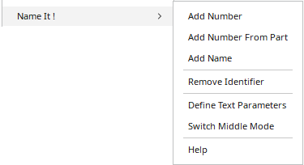
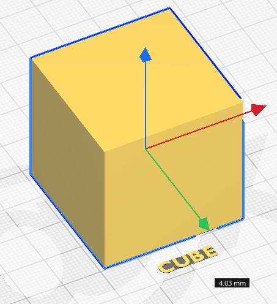
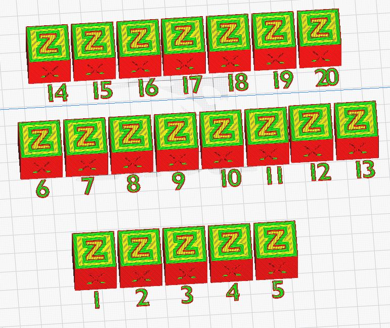
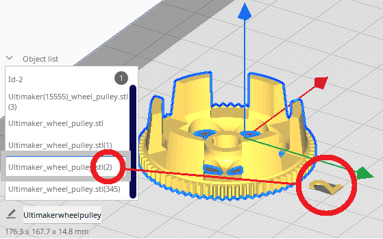
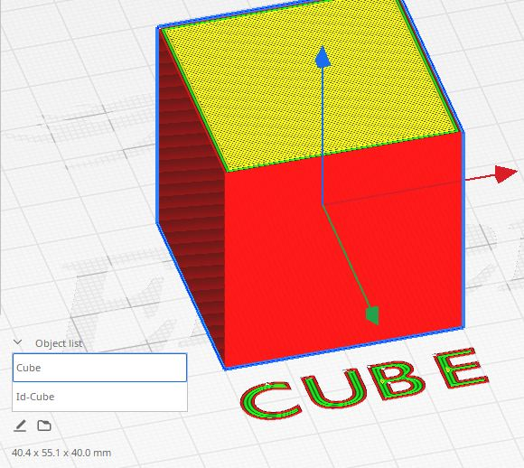
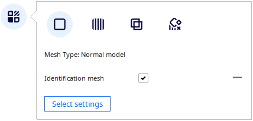
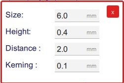
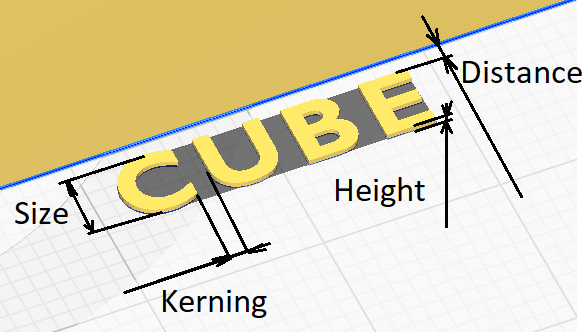

# Add Print Identifier

This plugin adds an identifier in front of each part present on the builtplate. This identifier can be either a number or the name of the part defined in Cura.

The identifier is linked to the model, if you move the part manually, the identifier will also be moved.

This plugin is using the [Trimesh](https://github.com/mikedh/trimesh) library to load STL files and for mesh manipulations.

## Add Number

Function to add a number in front of each part to identify every part. This function can be used by selecting the elements or a global identification without selection. 

Note ! If you use to select the elements, the selecting order will also give the number used to identify each models.

## Add Number From part

Function to add a number in front of each part to identify every part. This function can be used by selecting the elements or a global identification without selection. If the name of the part in the Cura Project contains an integer number between two parentheses; this number will be used to identify the part. Ie Ultimaker_wheel_pulley.stl **(2)** -> **2**.

## Add Name

Function to add the name of the element in front of each part to identify every part. This function can be used by selecting the elements or a global identification without selection. 

The name of the part is systematically converted into capital letters. This is a normal and desired feature. Capital letters are often easier to print (for example no dot on the i or j; I J)

## Remove Identifier

The function allows to delete all the meshes generated by the plugin.  At first all the meshes created in the session will be deleted. If meshes have been created previously and saved with the project by activating this menu a second time, these meshes will be deleted.

Note : the generated meshes are identified by a specific attribute "Identification Mesh"

### Define Text Size

The function **Define Text Size** gives you the possibility to change the text definition size.

## Help

This function will redirect you on the [Wiki](https://github.com/5axes/NameIt/wiki) of this repositery.
