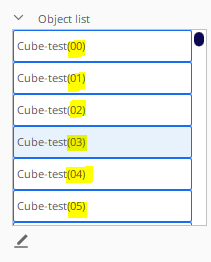
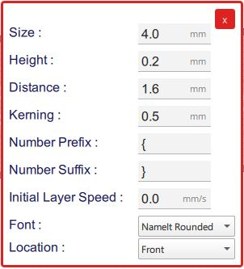
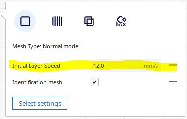
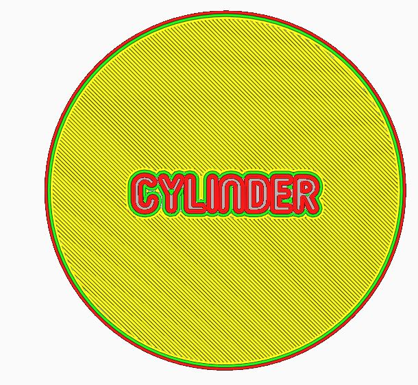
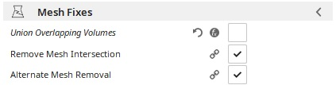
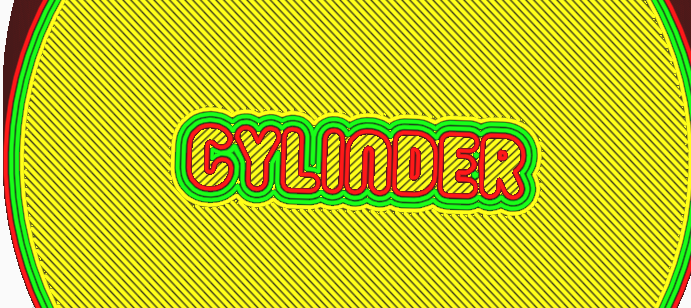
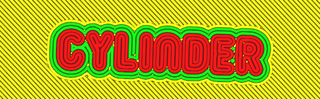
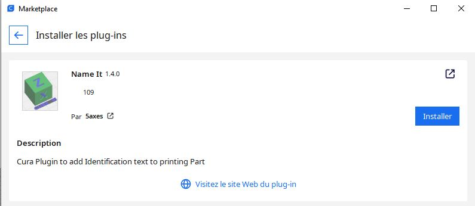

# Add Print Identifier

This plugin adds an identifier in front of each part present on the builtplate. This identifier can be either a number or the name of the part defined in Cura.

The identifier is linked to the model, if you move the part manually, the identifier will also be moved.

This plugin is using the [Trimesh](https://github.com/mikedh/trimesh) library to load STL files and for mesh manipulations.

The font used to create the texts is based on the [Gill Sans MT:style=Bold](https://docs.microsoft.com/en-us/typography/font-list/gill-sans-mt) font style.
And [Arial Rounded MT](https://docs.microsoft.com/en-us/typography/font-list/arial-rounded-mt)

## Add Number

Function to add a number in front of each part to identify every part. This function can be used by selecting the elements or a global identification without selection. 

Note ! If you use to select the elements, the selecting order will also give the number used to identify each models.

## Add Number From part

Function to add a number in front of each part to identify every part. This function can be used by selecting the elements or a global identification without selection. If the name of the part in the Cura Project contains an integer number between two parentheses; this number will be used to identify the part. Ie Ultimaker_wheel_pulley.stl **(2)** -> **2**.

## Add Name

Function to add the name of the element in front of each part to identify every part. This function can be used by selecting the elements or a global identification without selection. 

#### Rename Models

You can use the integrated function **Rename Models** to change the name of the element present on the builtplate before to use the function **Add Name**.

You can rename several model in the same times

In case of several modifications  the first Item will start from (0)  -> can be usefull for the function **Add Number From Part** Ie : [4#issuecomment](https://github.com/5axes/NameIt/issues/4#issuecomment-1159746200)

### Capitalization of the text

The name of the part is systematically converted into capital letters. This is a normal and desired feature. Capital letters are often easier to print (for example no dot on the i or j; I J)

## Remove Identifier

The function allows to delete all the meshes generated by the plugin.  At first all the meshes created in the session will be deleted. If meshes have been created previously and saved with the project by activating this menu a second time, these meshes will be deleted.

Note : the generated meshes are identified by a specific attribute "Identification Mesh"

## Define Text Parameters

The function **Define Text Parameters** gives you the possibility to change the text definition size and some additional parameter like ***Prefix*** and ***Suffix*** you can add to the **number identifiers**.

You can also specify a specific ***Initial Layer Speed*** used to print these marks.

### Text location option

#### Center & Center (not filled)

By using this option the text will be add not on the border of the part but mirrored in the center of the print. In this way only the line pattern of the first layer is modified, without adding to much print time.

 
If you want to use this mode, you must fix the ***Mesh Fixes*** Union Overlaping Volumes to ***false**.

It could be also possible according to the Cura release to modify the parameters ***Remove Mesh Intersection***  and ***Alternate Mesh Removal** to True.

The Location type **Center (not filled)** generate a model without infil/Wall and Top/bottom layer. The result if these settings is normaly a text engraved in the bottom of the part.

## Installation
----
#### Marketplace (recommended):
This plugin is now avalaible in the Cura marketplace. So you can install it automaticaly from this place:

[Name It on Ultimaker Market place](https://marketplace.ultimaker.com/app/cura/plugins/5axes/NameIt)

#### Manually:
First, make sure your Cura version is  4.4 or newer.

Download or clone the repository into `[Cura configuration folder]/plugins/NameIt`.

The configuration folder can be found via **Help** -> **Show Configuration Folder** inside Cura.

This menu opens the following folder:
* Windows: `%APPDATA%\cura\<Cura version>\`, (usually `C:\Users\<your username>\AppData\Roaming\cura\<Cura version>\`)
* Mac OS: `$HOME/Library/Application Support/cura/<Cura version>/`
* Linux: `$HOME/.local/share/cura/<Cura version>/`

## Help

This function will redirect you on the [Wiki](https://github.com/5axes/NameIt/wiki) of this repositery.
